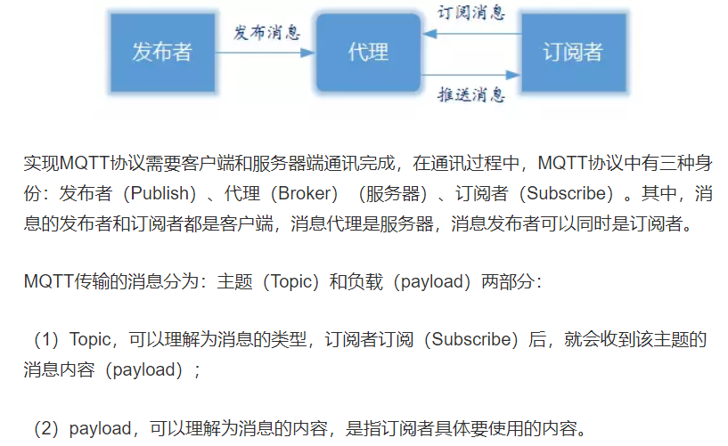

# MQTT 协议

1. MQTT协议提供了一种使用发布/订阅模型执行消息传递的轻量级方法,常用于物联网方面

2. 基于`TCP/IP`提供网络连接

3. 实现结构

   

4. 客户端功能 (即可以是发布者,也可以是订阅者):

   1. 发布可以被其他客户端订阅的消息
   2. 订阅其他客户端发布的消息

5. 服务器功能(`Broker`) :

   1. 接受来自客户的网络连接
   2. 接受客户发布的应用信息
   3. 处理来自客户端的订阅和退订请求
   4. 向订阅的客户转发应用程序消息

6. MQTT消息发布方式

   1. 至多一次 : 当发送时客户端未连接收到则不会再收到
   2. 至少一次 : 确保订阅的消息都收到但是消息可能会重复
   3. 只有一次 : 确保订阅的用户消息收到且只会收到一次

7. **MQTT协议内容**

   1. 会话 : 每个客户端与服务端连接之后就建立了一个会话
   2. 订阅 : **一个会话可以包含多个订阅,每个订阅有不同的主题筛选器**
   3. 主题名 : 匹配到一种消息的标识,服务器会将消息发送到订阅所匹配主题名的每个客户端
   4. 主题删选器 : 主题名的统配符

8. **MQTT协议方法**

   1. `Connect` : 等待与服务器建立连接
   2. `Disconnect` : 等待MQTT客户端完成所做的工作，并与服务器断开TCP/IP会话
   3. `Subscribe` : 等待完成订阅
   4. `UnSubscribe` : 等待服务器取消客户端的一个或多个topics订阅
   5. `Publish` : MQTT客户端发送消息请求，发送完成后返回应用程序线程。

## Eclipse Mosquitto

服务器端

1. 启动服务

   `mosquitto  -p [port] -v`

   例如

   `mosquitto  -p 1883 -v` 启动1883端口

## paho-mqtt

客户端

### 使用demo

1. 连接`Broker`接受消息

   ```python
   import paho.mqtt.client as mqtt
   
   def on_connect(client: mqtt.Client, userdata, flags, rc):
       print("Connect with result code " + str(rc))
       # 连接上之后订阅topic的主题
       # 在on_connect中实现当断开重连时会再次订阅
       client.subscribe("$SYS/#")
   
   def on_message(client: mqtt.Client, userdata, msg: mqtt.MQTTMessage):
       # 打印从Broker获得的message
       print(msg.topic + " " + str(msg.payload))
   
   if __name__ == '__main__':
       client = mqtt.Client()
       # 主要是实现这两个函数
       # on_connect为连接成功的回调函数
       client.on_connect = on_connect
       # on_message为每次接受订阅的消息的回调函数
       client.on_message = on_message
       # 试图连接
       client.connect("iot.eclipse.org", 1883, 60)
       # 不断尝试
       client.loop_forever()
   ```

   注意 :

   1. **一般注册`topic`在`on_connect`中完成 : 可以支持断开重连**
   2. **在接受订阅信息和发送订阅信息时最好都进行`client.loop_forever()`**,否则可能连接失败(具体原因不知道)

### 主要对象

1. `Client`

   1. 回调函数 : 

      1. `def on_connect(client: mqtt.Client, userdata, flags, rc)`

         实现连接成功之后进行函数回调

         **通常在该函数内实现对主题的订阅**

      2. `def on_message(client: mqtt.Client, userdata, msg: mqtt.MQTTMessage)`

         接受到订阅的消息时进行回调

      3. `def on_publish(client: mqtt.Client, userdata, result):`

         发送消息成功后进行回调

   2. 操作函数

      1. `connect(host, port=1883, keepalive=60, bind_address="")`

         连接服务器

      2. `publish(topic, payload=None, qos=0, retain=False)`

         `payload`为发送消息内容

         `qos`的等级1,2,3分别对应着3种发送消息方式

         * 0 代表消息只发送一次,可能会丢失
         * 1 代表消息确保送达,但是可能收到多次
         * 2 代表消息确保送到且只收到一次

   


